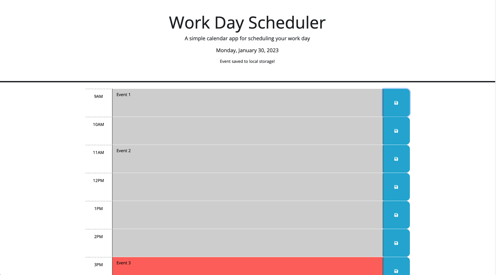

# Day Planner

## Description
This project is a 9am to 5pm day planner built using JavaScript, JQuery, HTML, and CSS. Link to deployed application: 

## Usage
This application includes the following functionality:
- a current time displayed at the top of the page
- color-coded time blocks to show past (grey), future (green), and which time block the user is currently on (red) depending on the user's current local time
- text area for user to input an event description
- save functionality to store user's events to local storage that renders when user refreshes or loads the page again after exiting their browser 
  
## Screenshot

